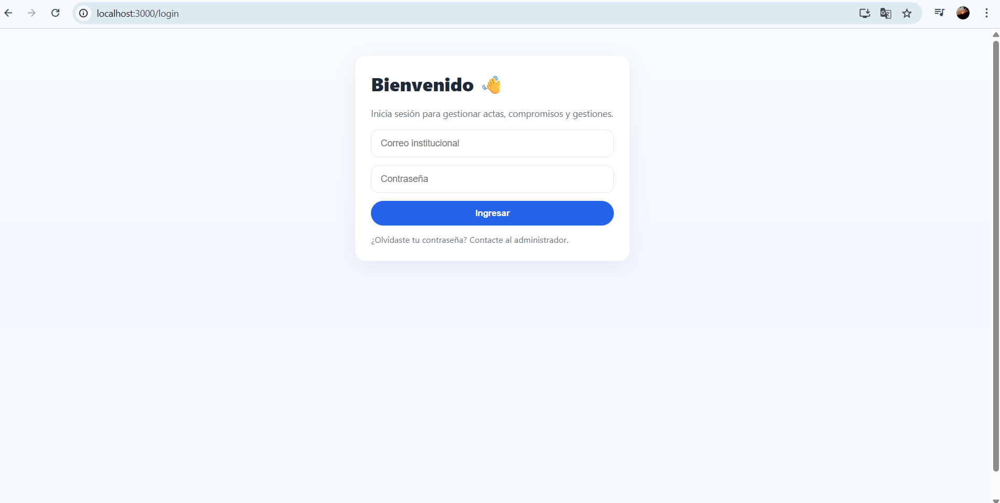
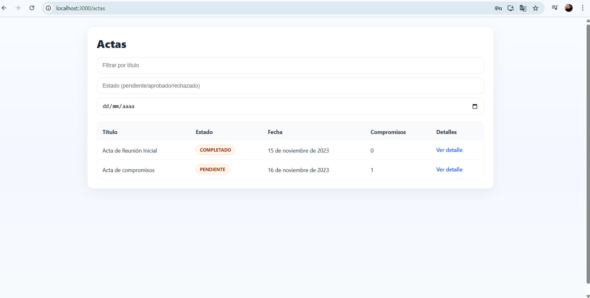
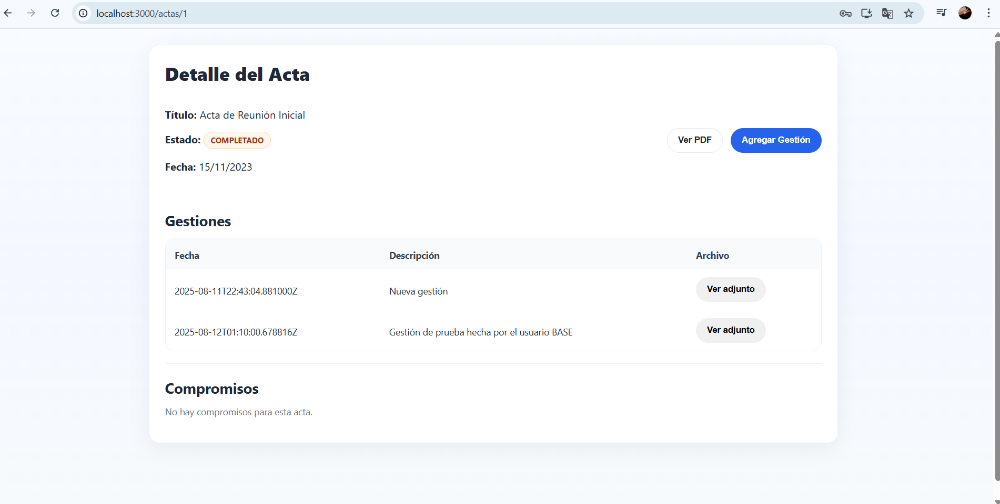
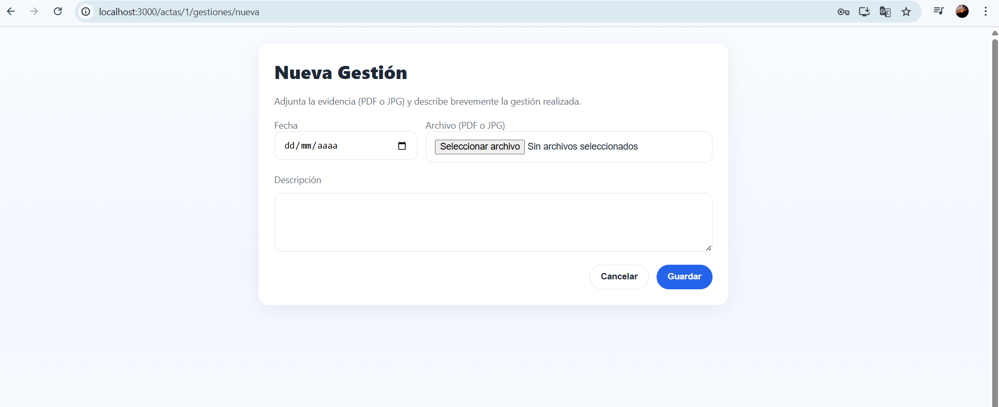
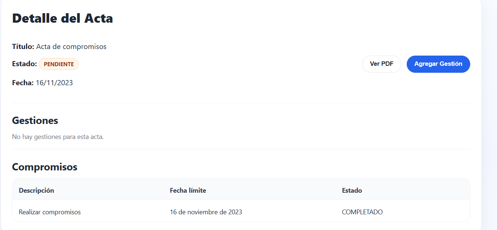

# PruebaTecnica
Repositorio creado exclusivamente para la creación y presentación de la prueba técnica para SoftSecret

# 📑 Módulo de Gestión de Actas, Compromisos y Gestiones

Proyecto independiente que permite **gestionar actas, compromisos y gestiones** con autenticación por rol, protección de archivos y consumo de API propia.  
Stack: **Django (backend)** + **React (frontend)** + **SQLite (base de datos local)**.

## 🚀 Funcionalidades

### 🔐 Autenticación
- Login clásico (`correo`, `contraseña`).
- Backend retorna datos del usuario y su rol.
- Roles:
  - **Administrador**: puede ver todas las actas, compromisos y gestiones.
  - **Usuario Base**: solo ve actas donde participa como creador o responsable.
- Sesión persistente en frontend.

### 📄 Gestión de Actas
- Panel `/actas/` con:
  - Título, estado, fecha, número de compromisos.
  - Filtros por título, estado y fecha.
- Detalle `/actas/:id/`:
  - Datos completos del acta.
  - Lista de compromisos y gestiones asociadas.
  - Visualización del PDF del acta (requiere autenticación).
  - Botón **"Agregar gestión"** según permisos.

### 🗂️ Gestiones
- Crear gestión con fecha, descripción y archivo adjunto.
- Validaciones:
  - Solo `.pdf` o `.jpg`.
  - Tamaño máximo 5MB.
- Archivos guardados en `/media/` y protegidos (requieren autenticación).

### 📌 Compromisos
- Listar compromisos de un acta.
- Posibilidad de marcar como **COMPLETADO**.

---

## 📦 Requisitos previos
- **Python 3.10+**
- **Node.js 18+**
- **npm** o **yarn**

---

## ⚙️ Instalación

### 1️⃣ Backend (Django)
```bash
# Clonar repositorio
git clone https://github.com/DiegoEsteban10/PruebaTecnica.git
cd modulo_actas 
cd backend

# Crear entorno virtual
python -m venv venv
source venv/bin/activate  # En Linux/Mac
venv\Scripts\activate     # En Windows

# Instalar dependencias
pip install -r requirements.txt

# Migrar base de datos
python manage.py migrate

# Cargar datos iniciales (usuarios, actas, etc.)
python manage.py loaddata C:localizaciondedondetengaelarchivo\PruebaTecnica\modulo_actas\backend\apps\usuarios\fixtures\datos_iniciales.json
# Ejecutar servidor
python manage.py runserver


#usuarios precargados
| Rol           | Correo               | Contraseña    |
| ------------  | -------------------- | ----------    |  
| Admin         | [admin@gmail.com]    | 1111          |
| Usuario Base1 | [base@ejemplo.com]   | Base123456    |
| Usuario Base2 | [usuario@gmail.com]  | contraseña111 |


# FrontEnd  (React)
cd frontend
npm install
npm start

El frontend se abrirá en http://localhost:3000.

#  Endpoints principales
Autenticación
POST /api/usuarios/login/ → Para probar el API
POST http://localhost:3000/login → Para iniciar sesión desde el navegador

Actas
GET /api/actas/ → Lista de actas

GET /api/actas/:id/ → Detalle de un acta

GET /api/actas/:id/pdf/ → PDF protegido del acta

Gestiones
GET /api/gestiones/ → Listar gestiones

POST /api/gestiones/ → Crear gestión

Compromisos
GET /api/compromisos/ → Listar compromisos

PATCH /api/compromisos/:id/marcar_completado/ → Marcar como completado

# Protección de archivos

Archivos servidos mediante /media-protegida/<archivo>.

Solo accesibles si el usuario está autenticado.

Si no, retorna 403 Forbidden.


# Capturas de pantallas

login


Actas con filtros


Detalle del acta


Formulario de gestion


Vista de compromisos
